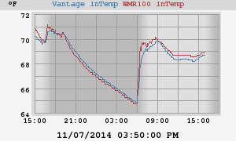

# Using multiple bindings

It's easy to use more than one database in your reports. Here's an
example. In my office I have two consoles: a VantagePro2 connected to a
Dell Optiplex, and a WMR100N, connected to a Raspberry Pi. Each is
running WeeWX. The Dell is using SQLite, the RPi, MySQL.

Suppose I wish to compare the inside temperatures of the two consoles.
How would I do that?

It's easier to access MySQL across a network than SQLite, so let's run
the reports on the Dell, but access the RPi's MySQL database remotely.
Here's how the bindings and database sections of `weewx.conf`
would look on the Dell:

``` ini hl_lines="14-22 31-34"
[DataBindings]
    # This section binds a data store to an actual database

    [[wx_binding]]
        # The database to be used - it should match one of the sections in [Databases]
        database = archive_sqlite
        # The name of the table within the database
        table_name = archive
        # The class to manage the database
        manager = weewx.manager.DaySummaryManager
        # The schema defines the structure of the database contents
        schema = weewx.schemas.wview_extended.schema

    [[wmr100_binding]]
        # Binding for my WMR100 on the RPi
        database = rpi_mysql
        # The name of the table within the database
        table_name = archive
        # The class to manage the database
        manager = weewx.manager.DaySummaryManager
        # The schema defines to structure of the database contents
        schema = weewx.schemas.wview_extended.schema

[Databases]
    # This section binds to the actual database to be used

    [[archive_sqlite]]
        database_type = SQLite
        database_name = weewx.sdb

    [[rpi_mysql]]
        database_type = MySQL
        database_name = weewx
        host = rpi-bug

[DatabaseTypes]
    #   This section defines defaults for the different types of databases.

    [[SQLite]]
        driver = weedb.sqlite
        # Directory in which the database files are located
        SQLITE_ROOT = archive

    [[MySQL]]
        driver = weedb.mysql
        # The host where the database is located
        host = localhost
        # The user name for logging in to the host
        user = weewx
        # The password for the user name
        password = weewx
    
```

The two additions have been ==highlighted==. The first, `[[wmr100_binding]]`,
adds a new binding called `wmr100_binding`. It links ("binds") to the new
database, called `rpi_mysql`, through the option `database`. It also defines
some characteristics of the binding, such as which manager is to be used and
what its schema looks like.

The second addition, `[[rpi-mysql]]`, defines the new database. Option
`database_type` is set to `MySQL`, indicating that it is a MySQL database.
Defaults for MySQL databases are defined in the section `[[MySQL]]`. The new
database accepts all of them, except for `host`, which as been set to the
remote host `rpi-bug`, the name of my Raspberry Pi.

## Explicit binding in tags

How do we use this new binding? First, let's do a text comparison,
using tags. Here's what our template looks like:

``` html hl_lines="8"
<table>
  <tr>
    <td class="stats_label">Inside Temperature, Vantage</td>
    <td class="stats_data">$current.inTemp</td>
  </tr>
  <tr>
    <td class="stats_label">Inside Temperature, WMR100</td>
    <td class="stats_data">$latest($data_binding='wmr100_binding').inTemp</td>
  </tr>
</table>
```

The explicit binding to `wmr100_binding` is highlighted. This tells the
reporting engine to override the default binding specifed in `[StdReport]`,
generally `wx_binding`, and use `wmr100_binding` instead.

<div class="example_output">
  Inside Temperature, Vantage   68.7°F<br/>
  Inside Temperature, WMR100    68.9°F
</div>

## Explicit binding in images

How would we produce a graph of the two different temperatures? Here's
what the relevant section of the `skin.conf` file would look
like.

``` ini hl_lines="6"
[[[daycompare]]]
   [[[[inTemp]]]]
       label = Vantage inTemp
   [[[[WMR100Temp]]]]
       data_type = inTemp
       data_binding = wmr100_binding
       label = WMR100 inTemp
```

This will produce an image with name `daycompare.png`, with two plot lines.
The first will be of the temperature from the Vantage. It uses the default
binding, `wx_binding`, and will be labeled `Vantage inTemp`. The second line
explicitly uses the `wmr100_binding`. Because it uses the same variable name
(`inTemp`) as the first line, we had to explicitly specify it using option
`data_type`, in order to avoid using the same subsection name twice (see
the section *[Including a type more than once in a plot](image-generator.md#include-same-sql-type-2x)*
for details). It will be labeled `WMR100 inTemp`. The results look like this:




## Stupid detail {#stupid-detail}

At first, I could not get this example to work. The problem turned out to be
that the RPi was processing things just a beat behind the Dell, so the
temperature for the "current" time wasn't ready when the Dell needed it.
I kept getting `N/A`. To avoid this, I introduced the tag `$latest`, which
uses the last available timestamp in the binding, which may or may not be
the same as what `$current` uses. That's why the example above uses `$latest`
instead of `$current`.
